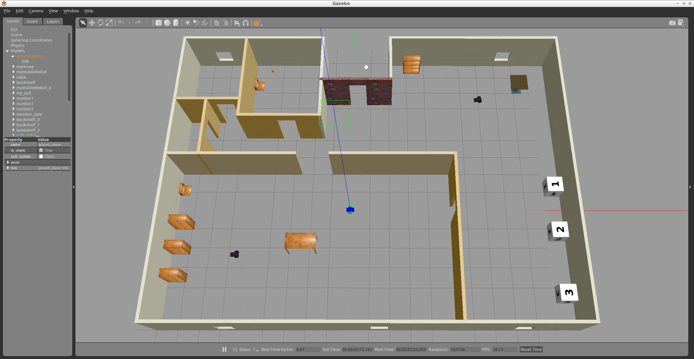
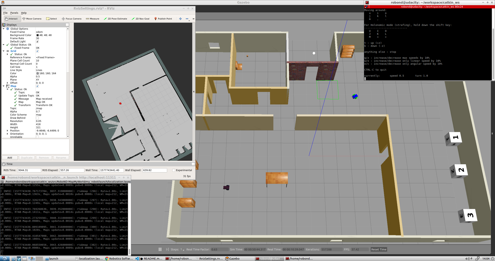

# RoboND-MapMyWorld
This is the repository for my Udacity Robotics Software Engineer Nanodegree Project - Map My World. In this project I created a 2D occupancy grid and 3D octomap from my simulated environment with my own robot with the RTAB-Map package.
It contains a simulation world with Gazebo which includes a robot equipped with a RGB-D camera and lidar sensor. The robot generates a map of it's surroundings with the ROS package RTAB-Map. The robot is also abl to localize itself with his own created map.

### Output
After launching the world the Building, MobileRobots, and the Robot (with camera and lidar) are displayed inside a Gazebo World. It should launch as follow:


After launching steps 4 and 5 you can choose to generate a map-database (step 6a) or to perform localization with a generated map-database (step 6b). If you launch step 6b and drive the robot around, it could look like that:


### Directory Structure
```
    .RoboND-MapMyWorld                            # main folder 
    ├── ball_chaser                             # ball_chaser package
    │   ├── launch                              # launch folder for launch files
    │   │   ├── ball_chaser.launch
    │   ├── src                                 # source folder for C++ scripts
    │   │   ├── drive_bot.cpp
    │   │   ├── process_images.cpp
    │   ├── srv                                 # service folder for ROS services
    │   │   ├── DriveToTarget.srv
    │   ├── CMakeLists.txt                      # compiler instructions
    │   ├── package.xml                         # package info
    ├── images                                  # output images
    │   ├── localization.png
    │   ├── output.png
    ├── my_robot                                # my_robot package
    │   ├── config                              # config files for the move base node
    │   │   ├── base_local_planner_params.yaml
    │   │   ├── costmap_common_params.yaml
    │   │   ├── global_costmap_params.yaml
    │   │   ├── local_costmap_params.yaml
    │   ├── launch                              # launch folder for launch files
    │   │   ├── amcl.launch
    │   │   ├── localization.launch
    │   │   ├── mapping.launch
    │   │   ├── robot_description.launch
    │   │   ├── RvizSettings.rviz
    │   │   ├── world.launch
    │   ├── maps                                # maps folder for maps
    │   │   ├── nancys_map.gpm                  # contains a map file for the world
    │   │   ├── nancys_map.yaml                 # contains parameters for nancys_map.gpm
    │   │   ├── rtabmap.db                      # contains the mapping database
    │   ├── meshes                              # meshes folder for sensors
    │   │   ├── hokuyo.dae
    │   ├── urdf                                # urdf folder for xacro files
    │   │   ├── my_robot.gazebo
    │   │   ├── my_robot.xacro
    │   ├── worlds                              # world folder for world files
    │   │   ├── nancys_world.world
    │   ├── CMakeLists.txt                      # compiler instructions
    │   ├── package.xml                         # package info
    ├── teleop_twist_keyboard                   # submodule Teleop
    │       ├── ...
    ├── .gitmodules                             # contains information about submodules
    └── README.md
```

### Steps to launch the simulation

#### 1 Clone the repository in the catkin workspace i.e. /home/workspace/catkin_ws/src
```sh
$ cd /home/workspace/catkin_ws/src
$ git clone https://github.com/ShamCondor/Map_My_World.git
```

#### 2 Compile the code
```sh
$ cd /home/workspace/catkin_ws/
$ catkin_make
```

#### 3 Launch the robot inside the Gazebo world and RViz
```sh
$ cd /home/workspace/catkin_ws/
$ source devel/setup.bash
$ roslaunch my_robot world.launch
```

#### 4 Launch Teleop Node
The robot can be controlled with the help of the teleop package. Thanks to the ROS community, I could use ros-teleop package to send commands to my robot using keyboard or controller.
In a new terminal launch the ros-teleop node:
```sh
$ cd /home/workspace/catkin_ws/
$ source devel/setup.bash
$ rosrun teleop_twist_keyboard teleop_twist_keyboard.py
```
More information can be found at https://github.com/ros-teleop/teleop_twist_keyboard

#### 5a Launch the RTAB-Map Mapping Node
This step is used to genreate a new map with RTAB-Map.
In a new terminal:
```sh
$ cd /home/workspace/catkin_ws/
$ source devel/setup.bash
$ roslaunch my_robot mapping.launch
```

#### 5b Launch the RTAB-Map Localization Node
This step is used to to perform localization using the created map database.
In a new terminal:
```sh
$ cd /home/workspace/catkin_ws/
$ source devel/setup.bash
$ roslaunch my_robot localization.launch
```

#### 6 Load the configuration file in RViz
Open the configuration file RvizSettings.rviz in RViz. It is located in:
```sh
/home/workspace/catkin_ws/src/my_robot/launch
```


